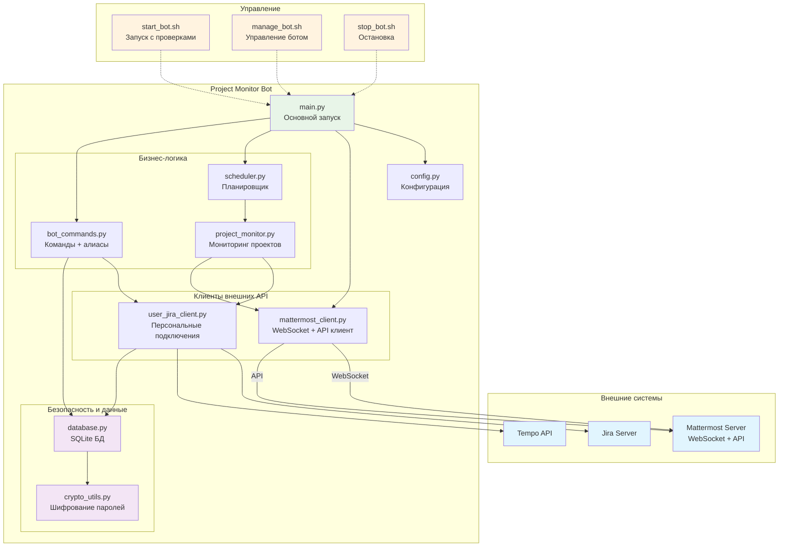
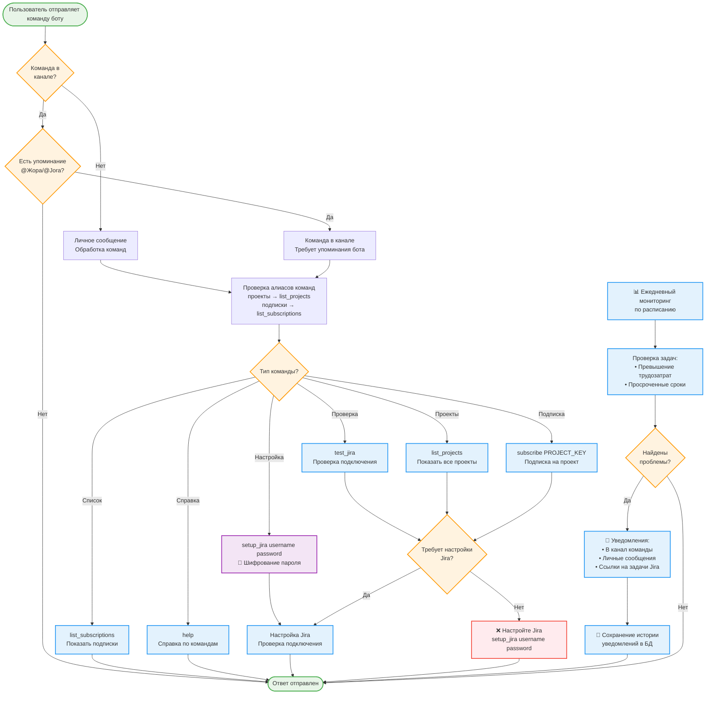

# Project Monitor Bot для Mattermost + Jira

🤖 Бот для мониторинга проектов в Jira - отслеживание превышения трудозатрат и просроченных сроков выполнения задач с уведомлениями в Mattermost.

🔐 **Версия с улучшенной безопасностью** - пароли пользователей шифруются современными алгоритмами, отсутствуют глобальные пароли в конфигурации.

## Возможности

- 🚨 **Мониторинг превышения трудозатрат** - уведомления когда фактическое время превышает плановое
- ⏰ **Отслеживание просроченных сроков** - уведомления о задачах с истекшим сроком выполнения  
- 📢 **Уведомления в каналы** - отчеты для команды проекта
- 💬 **Персональные уведомления** - прямые сообщения ответственным за задачи
- 🔗 **Кликабельные ссылки** - номера задач Jira в уведомлениях ведут на соответствующие страницы
- 📋 **Подписки на проекты** - каждый канал может подписаться на мониторинг своего проекта
- 🔐 **Персональные настройки Jira** - каждый пользователь настраивает свое подключение к Jira с шифрованием паролей
- 🗃️ **SQLite база данных** - хранение подписок, настроек и истории уведомлений
- ⚙️ **Команды администратора** - управление ботом и мониторингом
- 🎯 **Умные алиасы команд** - поддержка естественных команд на русском и английском языках
- 💡 **Контекстные подсказки** - бот предлагает правильные команды при ошибках
- 🌐 **WebSocket интеграция** - реальное время общения с Mattermost
- 📊 **Просмотр проектов** - команда для просмотра всех доступных проектов в Jira
- 🔧 **Поддержка on-premise** Jira

## Поддерживаемые системы

- **Mattermost** (любая версия с поддержкой ботов)
- **Jira Server/Data Center** (on-premise) с аутентификацией по паролю или API токенам

## Быстрый старт

### 1. Установка

```bash
git clone https://github.com/chastnik/mm_project_monitor_bot.git
cd mm_project_monitor_bot
chmod +x install.sh
./install.sh
```

### 2. Настройка

Скопируйте и отредактируйте конфигурацию:

```bash
cp env.example .env
nano .env
```

⚠️ **Важно**: Глобальные пароли Jira больше не требуются в `.env`! Каждый пользователь настраивает доступ через команды бота.

### 3. Запуск

```bash
# Рекомендуемый способ
./start_bot.sh prod

# Альтернативно - управление через скрипт
./manage_bot.sh start

# Для разработки
./start_bot.sh dev
# или
python main.py
```

## Конфигурация

### Основные параметры

```env
# Mattermost
MATTERMOST_URL=https://your-mattermost-server.com
MATTERMOST_TOKEN=your_bot_token
MATTERMOST_CHANNEL_ID=channel_id_for_reports

# Jira (on-premise) - только URL, без глобальных паролей!
JIRA_URL=https://jira.your-company.com
JIRA_VERIFY_SSL=true

# Tempo API
TEMPO_API_URL=https://jira.your-company.com/rest/tempo-timesheets/4
TEMPO_API_TOKEN=your_tempo_token


# Администраторы и расписание
ADMIN_EMAILS=admin1@company.com,admin2@company.com
CHECK_TIME=12:00
```

## Настройка каналов

### Добавление бота в канал

**⚠️ Обязательно:** Перед использованием команд в каналах бот должен быть добавлен в канал!

**Пошаговая инструкция:**
1. Зайти в нужный канал в Mattermost
2. Нажать на название канала → "Управление каналом"
3. Выбрать "Участники" → "Добавить участников"
4. Найти бота по имени (например, `jora` или `standup-bot`)
5. Добавить бота в канал
6. Проверить: отправить команду `help` в канал

## Команды бота

### Настройка подключения к Jira:
- `setup_jira <username> <password>` - настроить персональное подключение к Jira
- `test_jira` - проверить подключение к Jira
- `change_password <new_password>` - изменить пароль для Jira

### Просмотр проектов:
- `list_projects` - показать все доступные проекты в Jira

### Управление подписками (в каналах):
- **⚠️ Важно:** Бот должен быть добавлен в канал перед выполнением команд!
- **⚠️ Важно:** Команды в каналах работают только с упоминанием бота: `@Жора команда`
- `subscribe PROJECT_KEY` - подписать канал на мониторинг проекта
- `unsubscribe PROJECT_KEY` - отписать канал от мониторинга проекта
- `list_subscriptions` - показать активные подписки в канале

### Управление мониторингом:
- `run_subscriptions` - запустить проверку подписок текущего канала вручную
- `history [дни]` - история уведомлений
- `status` - статус бота и активные подписки

### Информационные команды:
- `help` - справка по командам
- `analytics PROJECT_KEY` - расширенная аналитика проекта (с графиками)

### Только для администраторов:
- `monitor_now` - запустить мониторинг всех проектов вручную
- `all_subscriptions` - просмотреть все подписки в системе
- `delete_subscription PROJECT_KEY CHANNEL_ID` - удалить конкретную подписку
- `list_users` - список пользователей с настройками Jira

### Алиасы команд:
Бот поддерживает естественные алиасы для всех команд:
- `help` / `справка` / `помощь` / `хелп` / `команды` / `что умеешь`
- `подписки` / `список подписок` / `мои подписки` / `что отслеживаешь`
- `проекты` / `список проектов` / `все проекты` / `доступные проекты` / `показать проекты` / `какие проекты`
- `подпиши` / `подпиши на проект` / `мониторить` / `отслеживать`
- `отпиши` / `отпиши от проекта` / `не мониторить` / `не отслеживать`
- `проверь` / `проверь подписки` / `запусти проверку` / `мониторинг`
- `настрой jira` / `настрой подключение` / `jira настройка` / `настрой джира` / `настрой джиру`
- `проверь jira` / `тест jira` / `проверь подключение`
- `смени пароль` / `измени пароль` / `новый пароль`
- `история` / `история уведомлений` / `что было`
- `статус` / `как дела` / `что происходит`
- `аналитика` / `аналитика проекта` / `покажи аналитику`
- `запусти мониторинг` / `мониторинг сейчас` / `проверь все` / `проверь всё`
- `все подписки` / `все подписки системы`
- `удали подписку` / `удалить подписку`
- `пользователи` / `список пользователей` / `кто подключен`

## Архитектура системы

### Компоненты и связи



### Структура файлов

```
├── main.py                 # Основной файл запуска
├── config.py              # Управление конфигурацией  
├── crypto_utils.py         # 🔐 Шифрование паролей пользователей
├── database.py            # Работа с SQLite БД (подписки, настройки, уведомления)
├── mattermost_client.py   # WebSocket + API интеграция с Mattermost
├── user_jira_client.py    # Персональные подключения к Jira с кешированием
├── project_monitor.py     # Мониторинг проектов и задач
├── scheduler.py           # Планировщик ежедневных проверок
├── bot_commands.py        # Обработка команд + алиасы + подсказки
├── start_bot.sh           # 🔧 Скрипт запуска с проверками безопасности
├── manage_bot.sh          # 🔧 Универсальное управление ботом
├── stop_bot.sh            # 🔧 Безопасная остановка бота
├── requirements.txt       # Зависимости (включая websockets, cryptography)
├── README.md              # Документация проекта
├── SETUP.md               # Подробная инструкция по настройке
├── USER_GUIDE.md          # Руководство пользователя
└── env.example            # Пример конфигурации
```

## Процесс работы с ботом



## Безопасность

🔐 **Современная система безопасности:**
- **Шифрование паролей**: все пароли пользователей шифруются AES-256 с PBKDF2HMAC
- **Отсутствие глобальных паролей**: нет централизованных учетных данных в конфигурации
- **Персональные подключения**: каждый пользователь использует свои права доступа к Jira
- **Безопасные файлы**: база данных и ключи шифрования защищены правами доступа 600
- **Обратная совместимость**: поддержка миграции старых незашифрованных данных

🛡️ **Меры защиты:**
- **Криптографическая соль**: уникальный ключ шифрования в файле `.crypto_salt`
- **Проверка зависимостей**: автоматическая проверка библиотеки `cryptography` при запуске
- **Изоляция процессов**: рекомендуется запуск от отдельного пользователя
- **Логирование безопасности**: все операции с паролями логируются без раскрытия данных

✅ **Гарантии безопасности:**
- Пароли **никогда** не хранятся в открытом виде
- Ключи шифрования **не попадают** в систему контроля версий
- Доступ к данным **только** у владельца файлов
- **Невозможность** расшифровки без доступа к серверу

## Требования

- **Python 3.8+** с поддержкой современной криптографии
- **Библиотека cryptography** ≥ 45.0.0 для шифрования паролей
- **Библиотека websockets** ≥ 11.0.0 для WebSocket соединения
- **Доступ к Mattermost API** (бот токен)
- **WebSocket поддержка** в Mattermost для реального времени
- **Персональный доступ к Jira** для каждого пользователя (логин/пароль)
- **Права на создание файлов** для базы данных и ключей шифрования

## Примеры использования

### Настройка пользователя
```
# Личные сообщения с ботом
setup_jira myusername mypassword
test_jira
```

### Работа в канале
```
# Просмотр доступных проектов
@Жора проекты

# Подписка на проект
@Жора подпиши на проект IDB

# Просмотр подписок
@Жора подписки

# Ручная проверка
@Жора проверь подписки
```

### Алиасы команд
```
# Все эти команды работают одинаково:
@Жора проекты
@Жора список проектов
@Жора все проекты

@Жора подписки
@Жора список подписок
@Жора что отслеживаешь

@Жора подпиши на проект IDB
@Жора мониторить IDB
@Жора отслеживать IDB
```

### Уведомления
Бот отправляет уведомления с кликабельными ссылками:
```
🚨 Превышение трудозатрат

📋 Задача: [PROJ-123](https://jira.company.com/browse/PROJ-123) - Разработка функции
👤 Ответственный: Иван Петров
⏱️ Плановые часы: 8.0ч
📈 Фактические часы: 12.0ч
❗ Превышение: 4.0ч
```

## Развертывание

Подробная инструкция по настройке и развертыванию в файле [SETUP.md](SETUP.md).

## Управление ботом

### Запуск и остановка

```bash
# Рекомендуемый способ запуска
./start_bot.sh prod

# Альтернативно - через управляющий скрипт  
./manage_bot.sh start

# Остановка
./stop_bot.sh
# или
./manage_bot.sh stop

# Перезапуск
./manage_bot.sh restart
```

### Мониторинг и диагностика

```bash
# Статус бота
./manage_bot.sh status

# Просмотр логов
./manage_bot.sh logs

# Логи в реальном времени
./manage_bot.sh tail

# Проверка подключений
./manage_bot.sh test
```

### Настройка пользователей

После запуска бота каждый пользователь должен настроить свой доступ к Jira:

```
# В личных сообщениях с ботом
setup_jira your_username your_password
test_jira

# В канале команды для подписки на проект
subscribe PROJECT_KEY
```

## Лицензия

MIT License - см. файл [LICENSE](LICENSE) для деталей.

## Поддержка

Если у вас есть вопросы или предложения:

1. Создайте [Issue](https://github.com/chastnik/mm_project_monitor_bot/issues) в GitHub
2. Проверьте [SETUP.md](SETUP.md) для решения типовых проблем
3. Изучите логи бота для диагностики
