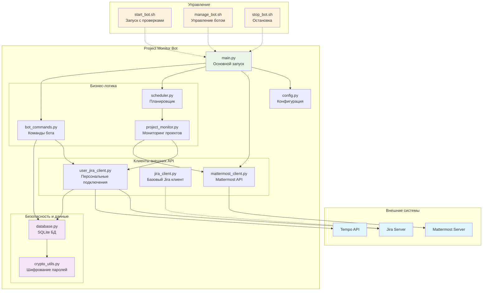
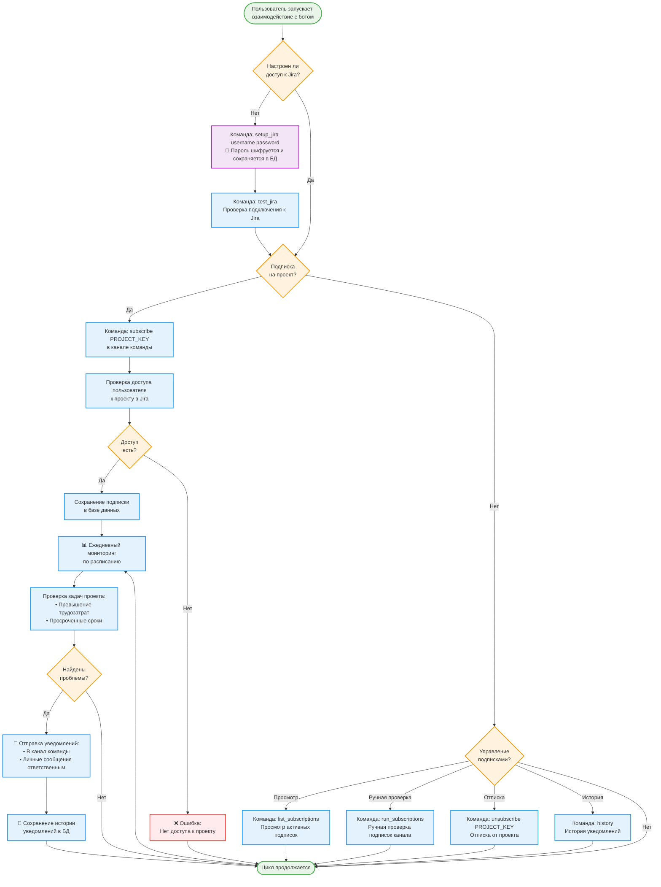

# Project Monitor Bot для Mattermost + Jira

🤖 Бот для мониторинга проектов в Jira - отслеживание превышения трудозатрат и просроченных сроков выполнения задач с уведомлениями в Mattermost.

🔐 **Версия с улучшенной безопасностью** - пароли пользователей шифруются современными алгоритмами, отсутствуют глобальные пароли в конфигурации.

## Возможности

- 🚨 **Мониторинг превышения трудозатрат** - уведомления когда фактическое время превышает плановое
- ⏰ **Отслеживание просроченных сроков** - уведомления о задачах с истекшим сроком выполнения  
- 📢 **Уведомления в каналы** - отчеты для команды проекта
- 💬 **Персональные уведомления** - прямые сообщения ответственным за задачи
- 📋 **Подписки на проекты** - каждый канал может подписаться на мониторинг своего проекта
- 🔐 **Персональные настройки Jira** - каждый пользователь настраивает свое подключение к Jira с шифрованием паролей
- 🗃️ **SQLite база данных** - хранение подписок, настроек и истории уведомлений
- ⚙️ **Команды администратора** - управление ботом и мониторингом
- 🔧 **Поддержка on-premise** Jira

## Поддерживаемые системы

- **Mattermost** (любая версия с поддержкой ботов)
- **Jira Server/Data Center** (on-premise) с аутентификацией по паролю или API токенам

## Быстрый старт

### 1. Установка

```bash
git clone https://github.com/chastnik/mm_standup_bot.git
cd mm_standup_bot
chmod +x install.sh
./install.sh
```

### 2. Настройка

Скопируйте и отредактируйте конфигурацию:

```bash
cp env.example .env
nano .env
```

⚠️ **Важно**: Глобальные пароли Jira больше не требуются в `.env`! Каждый пользователь настраивает доступ через команды бота.

### 3. Запуск

```bash
# Рекомендуемый способ
./start_bot.sh prod

# Альтернативно - управление через скрипт
./manage_bot.sh start

# Для разработки
./start_bot.sh dev
# или
python main.py
```

## Конфигурация

### Основные параметры

```env
# Mattermost
MATTERMOST_URL=https://your-mattermost-server.com
MATTERMOST_TOKEN=your_bot_token
MATTERMOST_CHANNEL_ID=channel_id_for_reports

# Jira (on-premise) - только URL, без глобальных паролей!
JIRA_URL=https://jira.your-company.com
JIRA_VERIFY_SSL=true

# Tempo API
TEMPO_API_URL=https://jira.your-company.com/rest/tempo-timesheets/4
TEMPO_API_TOKEN=your_tempo_token

# Администраторы и расписание
ADMIN_EMAILS=admin1@company.com,admin2@company.com
CHECK_TIME=12:00
```

## Команды бота

### Настройка подключения к Jira:
- `setup_jira [username] [password]` - настроить персональное подключение к Jira
- `test_jira` - проверить подключение к Jira
- `change_password <new_password>` - изменить пароль для Jira

### Управление подписками (в каналах):
- `subscribe PROJECT_KEY` - подписать канал на мониторинг проекта
- `unsubscribe PROJECT_KEY` - отписать канал от мониторинга проекта
- `list_subscriptions` - показать активные подписки в канале
- `run_subscriptions` - запустить проверку подписок текущего канала вручную

### Информационные команды:
- `help` - справка по командам
- `history [дни]` - история уведомлений
- `status` - статус бота и активные подписки

### Только для администраторов:
- `monitor_now` - запустить мониторинг всех проектов вручную
- `all_subscriptions` - просмотреть все подписки в системе
- `delete_subscription PROJECT_KEY CHANNEL_ID` - удалить конкретную подписку

## Архитектура системы

### Компоненты и связи



### Структура файлов

```
├── main.py                 # Основной файл запуска
├── config.py              # Управление конфигурацией  
├── crypto_utils.py         # 🔐 Шифрование паролей пользователей
├── database.py            # Работа с SQLite БД (подписки, настройки, уведомления)
├── mattermost_client.py   # Интеграция с Mattermost
├── jira_client.py         # Базовый клиент Jira (отключен)
├── user_jira_client.py    # Персональные подключения к Jira с кешированием
├── project_monitor.py     # Мониторинг проектов и задач
├── scheduler.py           # Планировщик ежедневных проверок
├── bot_commands.py        # Обработка команд подписки и настроек
├── start_bot.sh           # 🔧 Скрипт запуска с проверками безопасности
├── manage_bot.sh          # 🔧 Универсальное управление ботом
├── stop_bot.sh            # 🔧 Безопасная остановка бота
└── requirements.txt       # Зависимости (включая cryptography)
```

## Процесс работы с ботом



## Безопасность

🔐 **Современная система безопасности:**
- **Шифрование паролей**: все пароли пользователей шифруются AES-256 с PBKDF2HMAC
- **Отсутствие глобальных паролей**: нет централизованных учетных данных в конфигурации
- **Персональные подключения**: каждый пользователь использует свои права доступа к Jira
- **Безопасные файлы**: база данных и ключи шифрования защищены правами доступа 600
- **Обратная совместимость**: поддержка миграции старых незашифрованных данных

🛡️ **Меры защиты:**
- **Криптографическая соль**: уникальный ключ шифрования в файле `.crypto_salt`
- **Проверка зависимостей**: автоматическая проверка библиотеки `cryptography` при запуске
- **Изоляция процессов**: рекомендуется запуск от отдельного пользователя
- **Логирование безопасности**: все операции с паролями логируются без раскрытия данных

✅ **Гарантии безопасности:**
- Пароли **никогда** не хранятся в открытом виде
- Ключи шифрования **не попадают** в систему контроля версий
- Доступ к данным **только** у владельца файлов
- **Невозможность** расшифровки без доступа к серверу

## Требования

- **Python 3.8+** с поддержкой современной криптографии
- **Библиотека cryptography** ≥ 45.0.0 для шифрования паролей
- **Доступ к Mattermost API** (бот токен)
- **Персональный доступ к Jira** для каждого пользователя (логин/пароль)
- **Права на создание файлов** для базы данных и ключей шифрования

## Развертывание

Подробная инструкция по настройке и развертыванию в файле [SETUP.md](SETUP.md).

## Управление ботом

### Запуск и остановка

```bash
# Рекомендуемый способ запуска
./start_bot.sh prod

# Альтернативно - через управляющий скрипт  
./manage_bot.sh start

# Остановка
./stop_bot.sh
# или
./manage_bot.sh stop

# Перезапуск
./manage_bot.sh restart
```

### Мониторинг и диагностика

```bash
# Статус бота
./manage_bot.sh status

# Просмотр логов
./manage_bot.sh logs

# Логи в реальном времени
./manage_bot.sh tail

# Проверка подключений
./manage_bot.sh test
```

### Настройка пользователей

После запуска бота каждый пользователь должен настроить свой доступ к Jira:

```
# В личных сообщениях с ботом
setup_jira your_username your_password
test_jira

# В канале команды для подписки на проект
subscribe PROJECT_KEY
```

## Лицензия

MIT License - см. файл [LICENSE](LICENSE) для деталей.

## Поддержка

Если у вас есть вопросы или предложения:

1. Создайте [Issue](https://github.com/chastnik/mm_standup_bot/issues) в GitHub
2. Проверьте [SETUP.md](SETUP.md) для решения типовых проблем
3. Изучите логи бота для диагностики
